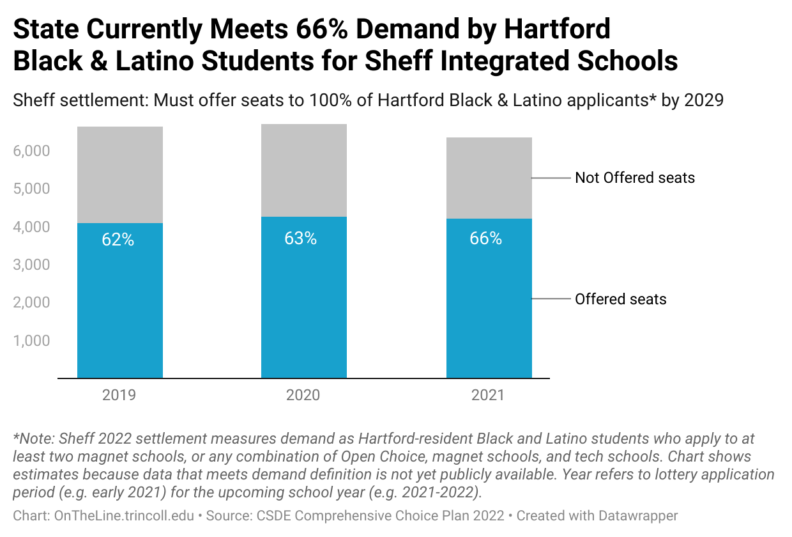

# otl-sheff-data
Sheff v O'Neill school integration public data for OnTheLine.trincoll.edu book

## Meet Demand for Hartford Black and Latino Students in Diverse Schools, 2019-2021

- [interactive chart in Datawrapper](https://datawrapper.dwcdn.net/GkjCa/3/)
- by OnTheLine.trincoll.edu
- [Get the Data](2019-2021-meet-demand.csv)
- Note: Sheff 2022 settlement measures demand as Hartford-resident Black and Latino students who apply to at least two magnet schools, or any combination of Open Choice, magnet schools, and tech schools. Chart shows estimates because data that meets demand definition is not yet publicly available. Year refers to lottery application period (e.g. early 2021) for the upcoming school year (e.g. 2021-2022).
- Source: Comprehensive Choice Plan, Jan 2022, Hartford Resident Minority Applicants (attachments 4-5-6, PDF pages 61-63), <http://civilinquiry.jud.ct.gov/DocumentInquiry/DocumentInquiry.aspx?DocumentNo=22109303>.
- Definitions of demand, Comp Choice Plan, PDF page 6: "The goal of the CCP is to meet the demand of Hartford-resident minority students for reduced isolation and desegregated settings... Demand refers to the number of on-time and late Hartford-resident applicants who selected at least one magnet school plus Open Choice and/or CTECS; Open Choice and/or CTECS and no magnet schools; or, if applying to magnet schools only, two magnet schools."									

## Hartford Black and Latino Students in Diverse Schools, 2004-2021

- [interactive chart in Datawrapper](https://datawrapper.dwcdn.net/0O6sz/3/)
- by Michael Kulik '23 and Maria Vicuna '24, Trinity College
- [Get the Data](2004-2021-hartford-black-latino-diverse-schools.csv)
- Note: Definitions of Reduced-Isolation Schools and Minority Students changed over time in Sheff v O'Neill legal settlements. Does not include Interdistrict Cooperative Grant percentages. Shows October enrollments (e.g. 2021) for school year (e.g. 2021-2022).
- Sources:
  - For October 2019-2020-2021: CSDE, Summary of All Hartford-Resident, Minority, PK-12 Public School Students Enrolled in School Meeting Reduced Isolation (RI) Goal (see PDF in repo)
  - For October 2004-2018: Jacqueline Rabe Thomas, CT Mirror chart https://projects.ctmirror.org/tools/chart/charts/WhereHartfordminoritystudentsattendschool-4-11-2018-36291.html, in Jacqueline Rabe Thomas, “Segregated Hartford Schools Await next Governor,” CT Mirror, December 27, 2018, https://ctmirror.org/2018/12/27/segregated-hartford-schools-await-next-governor/, with chart backup in otl-ctm-projects repo
