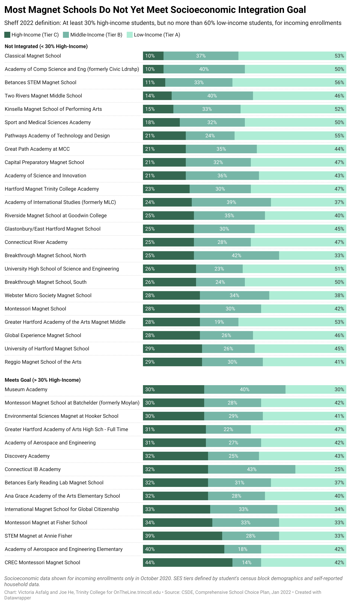
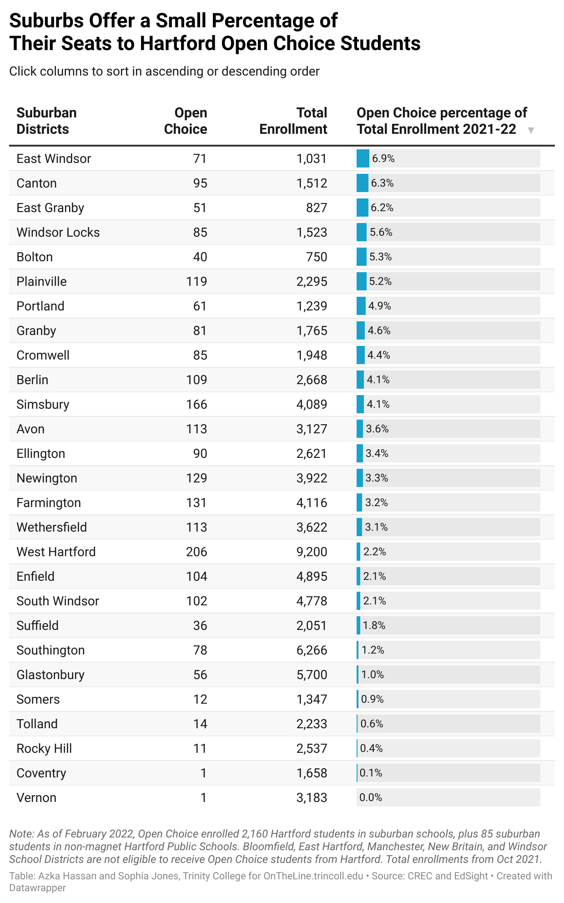

# otl-sheff-data
Sheff v O'Neill school integration public data for OnTheLine.trincoll.edu book

Learn more at <https://OnTheLine.trincoll.edu>

To re-use visualizations (and credit the authors), go to the [Datawrapper River](https://app.datawrapper.de/river/) and search "ontheline" for items related to the [On The Line](https://ontheline.trincoll.edu) book-in-progress. To learn how to use the free Datawrapper data visualization tool, see [Chapter 6: Chart Your Data](https://handsondataviz.org/chart.html) in the open-access book by Jack Dougherty and Ilya Ilyankou, [Hands-On Data Visualization](https://handsondataviz.org), (2021).

## Meet Demand for Hartford Black and Latino Students in Diverse Schools, 2019-2021

- [interactive chart in Datawrapper](https://datawrapper.dwcdn.net/qeZTm/1/)
- by OnTheLine.trincoll.edu
- [Get the Data](2019-2021-meet-demand.csv)
- Note: Sheff 2022 settlement measures demand as Hartford-resident Black and Latino students who apply to at least two magnet schools, or any combination of Open Choice, magnet schools, and tech schools. Chart shows estimates because data that meets demand definition is not yet publicly available. Year refers to lottery application period (e.g. early 2021) for the upcoming school year (e.g. 2021-2022).
- Source: Comprehensive Choice Plan, Jan 2022, Hartford Resident Minority Applicants (attachments 4-5-6, PDF pages 61-63), <http://civilinquiry.jud.ct.gov/DocumentInquiry/DocumentInquiry.aspx?DocumentNo=22109303>.
- Definitions of demand, Comp Choice Plan, PDF page 6: "The goal of the CCP is to meet the demand of Hartford-resident minority students for reduced isolation and desegregated settings... Demand refers to the number of on-time and late Hartford-resident applicants who selected at least one magnet school plus Open Choice and/or CTECS; Open Choice and/or CTECS and no magnet schools; or, if applying to magnet schools only, two magnet schools."									

## Hartford Black and Latino Students in Diverse Schools, 2004-2021

- [interactive chart in Datawrapper](https://datawrapper.dwcdn.net/wcDgI/1/)
- by Michael Kulik '23 and Maria Vicuna '24, Trinity College
- [Get the Data](2004-2021-hartford-black-latino-diverse-schools.csv)
- Note: Definitions of Reduced-Isolation Schools and Minority Students changed over time in Sheff v O'Neill legal settlements. Does not include Interdistrict Cooperative Grant percentages. Shows October enrollments (e.g. 2021) for school year (e.g. 2021-2022).
- Sources:
  - For October 2019-2020-2021: CSDE, Summary of All Hartford-Resident, Minority, PK-12 Public School Students Enrolled in School Meeting Reduced Isolation (RI) Goal (see PDF in repo)
  - For October 2004-2018: Jacqueline Rabe Thomas, CT Mirror chart https://projects.ctmirror.org/tools/chart/charts/WhereHartfordminoritystudentsattendschool-4-11-2018-36291.html, in Jacqueline Rabe Thomas, “Segregated Hartford Schools Await next Governor,” CT Mirror, December 27, 2018, https://ctmirror.org/2018/12/27/segregated-hartford-schools-await-next-governor/, with chart backup in otl-ctm-projects repo

## Total Sheff Applications at 71% of Pre-Pandemic Levels, 2019-2022

- [interactive chart in Datawrapper](https://datawrapper.dwcdn.net/AnoKO/4/)
- by OnTheLine.trincoll.edu
- [Get the Data](2019-2022-total-applications.md)
- Note: Total applications to Regional School Choice Office for lottery year at end of March (or March 21st for 2022).
- 13,693 / 19,246 = 71%
- Source: CSDE email from Robin Cecere, 4 April 2022

## Socioeconomic Integration by Magnet School Incoming Enrollments, 2020  

- [interactive chart in Datawrapper](https://datawrapper.dwcdn.net/ckxTr/1/)
- by Victoria Asfalg '23 and Joe He '24, Trinity College
- [Get the Data](2020-socioeconomic-integration-magnet-incoming.csv)
- Sheff 2022 definition: At least 30% high-income students, but no more than 60% low-income students, for incoming enrollments.
- See visual definition PNG:

- See also [visual definition PSD file for editing](define-ses-integration.psd)
- Note: Socioeconomic data shown for incoming enrollments only in October 2020. SES tiers defined by student's census block demographics and self-reported household data.
- Source: October 2020 socioeconomic integration by magnet school, for incoming enrollments only, CSDE, Comprehensive School Choice Plan, Jan 2022, PDF pages 69-72, <http://civilinquiry.jud.ct.gov/DocumentInquiry/DocumentInquiry.aspx?DocumentNo=22109303>
- See also Sheff 2020 settlement for more details about socioeconomic integration

## Suburban Enrollments for Open Choice, 2022

- [interactive table in Datawrapper](https://datawrapper.dwcdn.net/g7UYm/1/)
- by Azka Hassan '23 and Sophia Jones '24, Trinity College
- [Get the Data](2022-02-open-choice-by-district.csv)
- Note: As of February 2022, Open Choice enrolled 2,160 Hartford students in suburban schools, plus 85 suburban students in non-magnet Hartford Public Schools. Bloomfield, East Hartford, Manchester, New Britain, and Windsor School Districts are not eligible to receive Open Choice students from Hartford. Total enrollments from Oct 2021.
- Sources:
  - Open Choice enrollments (as of 11 Feb 2022) from [CREC Open Choice presentation and data 2022](2022-02-19-CREC-OpenChoicePres-Data.pdf)
  - District enrollments, October 2021, downloaded from CSDE EdSight <https://edsight.ct.gov/SASPortal/main.do>

## Test Disparities by Race in Magnet Schools, 2018-19

- [interactive chart in Datawrapper](https://datawrapper.dwcdn.net/K9q0M/2/)
- by Daisy Li '24 and Teddy Komjathy '24, Trinity College
- [Get the Data](2018-19-SBAC-math-goal-race-magnet.csv)
- Note: Only selected magnet schools shown due to different tests by grade levels and data suppression for small groups. Based on most recently available disaggregated public data.
- Source: CSDE EdSight <https://edsight.ct.gov/SASPortal/main.do>
- We would prefer that the chart above not focus on Black student versus White student outcomes in magnet schools. Instead, a better measure of quality integrated education inside Sheff schools would be Hartford-resident versus non-Hartford-resident data across a wider range of student outcomes, not just test proficiency. In fact, the Data Transparency and Public Data sections of the [Sheff 2020 settlement](http://civilinquiry.jud.ct.gov/DocumentInquiry/DocumentInquiry.aspx?DocumentNo=18496368) and the [Sheff 2022 settlement](https://civilinquiry.jud.ct.gov/DocumentInquiry/DocumentInquiry.aspx?DocumentNo=22109303) require CSDE to share disaggregated student data by town of residence for various outcomes (test performance and growth, attendance, graduation, suspensions and expulsions, etc.). But CSDE has not yet made this type of disaggregated data publicly available.
- To fulfill the terms of the 2022 settlement, CSDE should report disaggregated student data in two larger residential groups---Hartford-residents and non-Hartford-residents---to show meaningful information about educational quality inside Sheff schools, while avoiding small-cell data suppression issues that would arise when reporting individual towns of residence. Furthermore, CSDE should report this disaggregated data by residential group for all Sheff schools, not just interdistrict magnets, as shown below:  

| School Name          | Hartford-resident data | Non-Hartford-resident data |
|----------------------|------------------------|----------------------------|
| Magnet School A      |                        |                            |
| Magnet School B      |                        |                            |
| Magnet School C      |                        |                            |
| Open Choice School D |                        |                            |
| Open Choice School E |                        |                            |
| Open Choice School F |                        |                            |
| CT Tech School G     |                        |                            |
